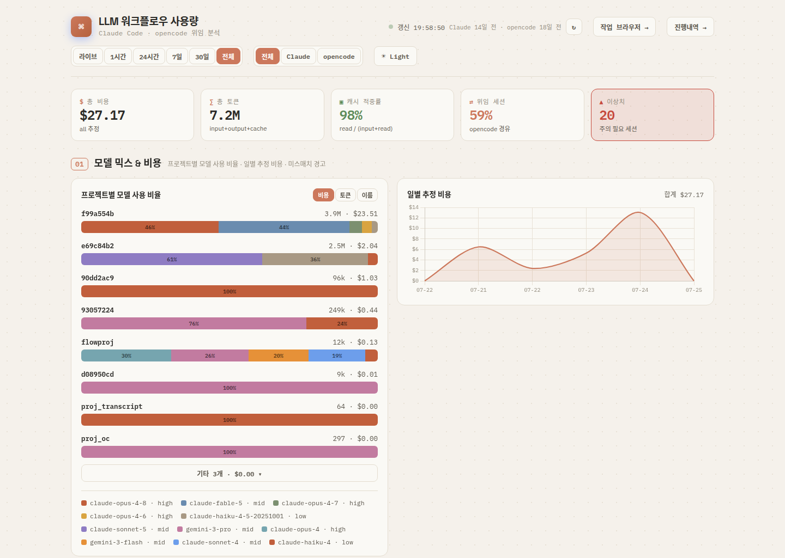
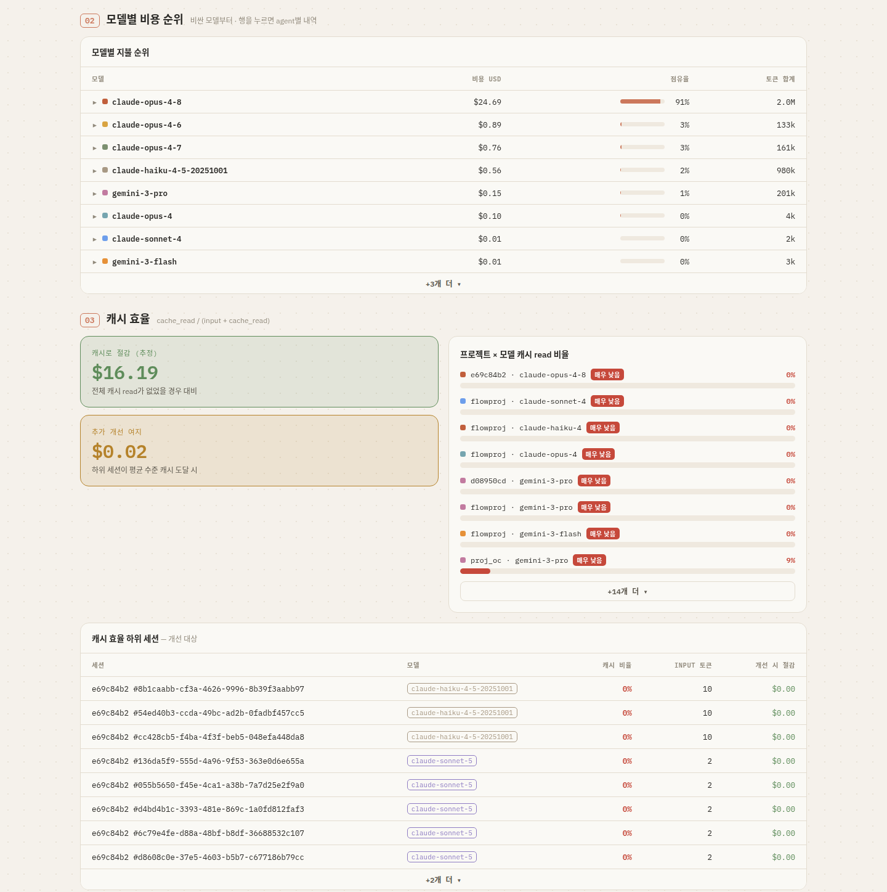
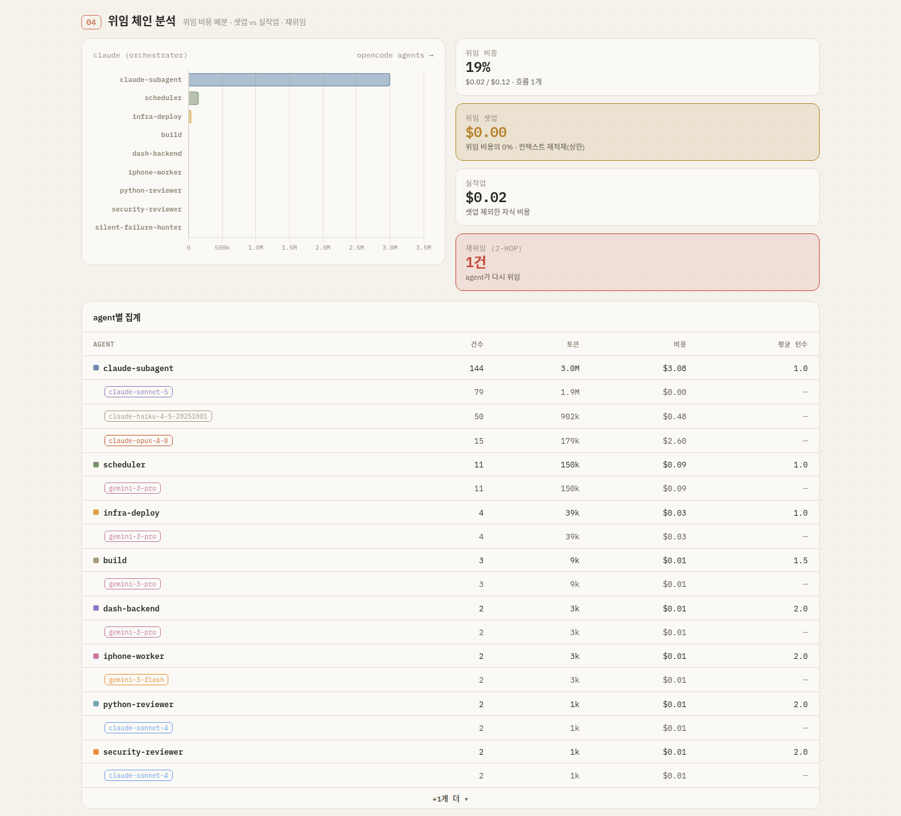
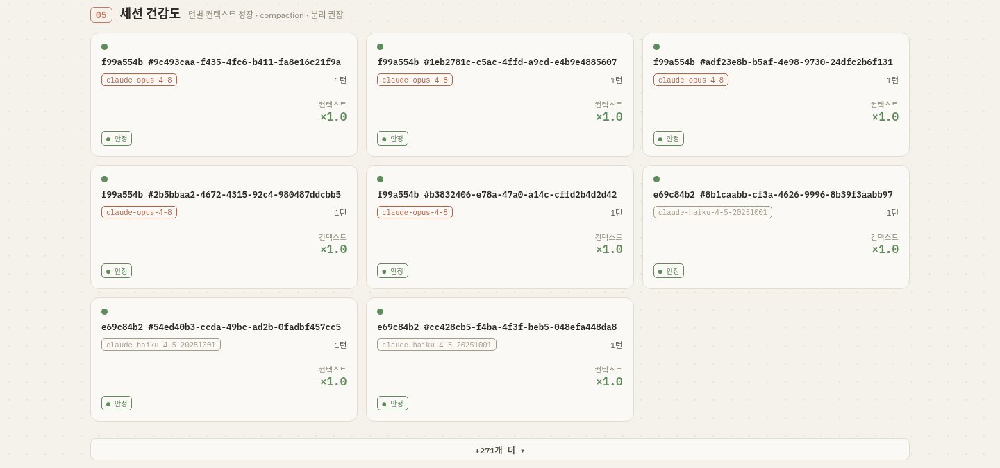
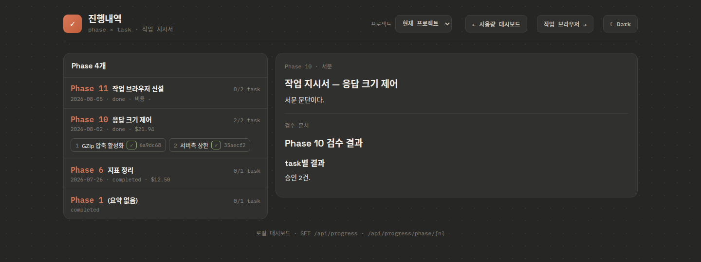

# debt-radar

  

Claude Code·opencode에 **위임한 개발**의 사용량·건전성·**위임부채**를 한 화면에서 보는 로컬 대시보드.

> **위임부채(delegation debt)** — 코드는 나왔는데 나에게 남지 않은 것.
> **인지부채**(산출물 ↔ 이해의 격차)와 **의도부채**(산출물 ↔ 의도의 격차)를 아우르는 총칭이다.
> 위임 개발은 속도를 얻는 대신 이 부채를 쌓는다. debt-radar는 그 잔액을 드러내는 쪽에 선다.



> 이 문서의 모든 스크린샷은 실데이터가 아니라 **익명화 픽스처 데이터**(`tests/fixtures/`)로 렌더링한 것이다.
> 스크린샷은 리브랜딩 이전 빌드에서 캡처해 상단 로고 문구가 옛 이름으로 보인다 — 화면 구성은 동일하다.

## 세 기둥

### ① 세션 사용량 — 무엇에 얼마를 썼나

- **모델 믹스 & 비용** — 프로젝트별 모델 사용 비율, 일별 비용, 미스매치(비싼 모델 × 저난도 작업) 경고
- **모델별 비용 순위** — 어느 모델이 얼마를 물고 있는가, 행을 펼치면 어느 agent가 쓰는지
- **캐시 효율** — 프로젝트×모델 `cache_read / (input + cache_read)`, 개선 대상 하위 세션, 절감 추정액

### ② 워크플로우 건전성 — 위임이 제대로 굴러갔나

- **위임 체인** — 오케스트레이터 → opencode agent 흐름, agent×model 브레이크다운, 위임 오버헤드(셋업 vs 실작업), 2-hop 재위임 감지
- **세션 건강도** — 컨텍스트 성장 스파크라인, compaction 마커, split 권장 플래그
- **작업 흐름 감사** — 페이즈 × 8단계 게이트 도달 판정. 증거는 `events.jsonl` 실측(measured)이 문서·git 추정(inferred)보다 우선하고, **미도달(missing)과 건너뜀(skipped)을 구분한다** — 뒤 단계는 도달했는데 앞 단계 증거가 없으면 skipped, 즉 "GATE 없이 코드가 바뀐 페이즈"라는 감사 신호다
- **진행내역 경고** — 문서 규약 위반·판정 미상 등을 코드·심각도로 분류해 같은 종류끼리 묶어 보여준다

### ③ 위임부채 감소 — 산출물이 나에게 남았나

- **인지부채 지표** — 페이즈별 '설명 가능성' 부채를 문서 증거로 근사한다. **점수를 지어내지 않고** 신호를 나열한 뒤 3단계 등급만 붙인다:
  `repaid`(최신 쪽지시험의 미해소 갭 0) · `partial`(갭 잔존, 또는 시험은 없지만 판정·리뷰가 온전) · `unrepaid`(시험 없음 + 판정 미상 task 또는 리뷰 부재)
- **쪽지시험** — 페이즈 산출물을 두고 LLM이 묻는 대화형 구술시험. 답은 사용자 입에서 나와야 하고, 개방형 질문 → 꼬리질문 순으로 가되 같은 주제는 한 번만 확인한다. 종료 시 **평가와 지표만** 기록으로 남기고 **대화 전사는 저장하지 않는다**

## 화면

| | |
|---|---|
|  |  |
| **모델별 비용 순위 · 캐시 효율** — 모델 지불 순위, 프로젝트×모델 캐시 read 비율, 개선 대상 하위 세션 | **위임 체인 분석** — 오케스트레이터→agent 토큰 분포, 위임 셋업 vs 실작업 비용, 재위임(2-hop) 감지 |
|  |  |
| **세션 건강도** — 세션별 컨텍스트 성장 배율과 안정/주의 판정 | **진행내역** — phase×task 격자, 지시서·검수 문서 뷰어, 인지부채 배지·쪽지시험 (`/static/progress.html`) |

그 밖에 **작업 흐름**(`/static/flow.html`) — 페이즈×8단계 게이트 감사,
**세션 상세**(`/static/sessions.html`) — 세션별 변경 diff 검토 화면이 있다.

## 데이터 소스 (읽기 전용)

| 소스 | 위치 | 형태 |
|------|------|------|
| Claude Code 세션 | `~/.claude/projects/<프로젝트>/*.jsonl` | JSONL |
| opencode 세션 | `~/.local/share/opencode/opencode.db` | SQLite (라이브 WAL) |
| 페이즈 문서 | `<docs_root>/PHASE<N>_<slug>.md`, `reviews/`, `quizzes/` | Markdown |
| 오케스트레이트 레지스트리 | `~/.local/state/orchestrate/registry/<project>.json` | JSON |

원본은 절대 수정하지 않는다. 컨테이너 마운트도 `:ro` 강제.
유일한 쓰기는 쪽지시험 기록(`<docs_root>/quizzes/`)이고, 쓰기가 막히면 크래시 대신 **원문 반환으로 강등**한다.

## 빠른 시작

### Docker (권장)

```bash
docker compose build
docker compose up -d
docker compose logs -f          # 30초 후 healthcheck 통과 확인
curl -s http://127.0.0.1:9280/health   # → {"status":"ok"}
```

브라우저: http://127.0.0.1:9280 (로컬에서만 접속 가능. 외부 노출은 터널 경유)

배포·터널 상세: **[docs/DEPLOY.md](docs/DEPLOY.md)**

### 로컬 개발 (Docker 없이)

```bash
python3 -m venv .venv
.venv/bin/pip install -e ".[dev]"

USAGE_CLAUDE_ROOT=~/.claude/projects \
USAGE_OPENCODE_DB=~/.local/share/opencode/opencode.db \
.venv/bin/uvicorn app.main:app --host 127.0.0.1 --port 9280
```

## 설정

| 환경 변수 | 기본값 | 용도 |
|---|---|---|
| `USAGE_CLAUDE_ROOT` | `~/.claude/projects` | Claude Code 세션 JSONL 루트 |
| `USAGE_OPENCODE_DB` | `~/.local/share/opencode/opencode.db` | opencode 세션 DB (read-only URI) |
| `USAGE_PRICING_FILE` | `config/pricing.json` | 모델 단가 오버라이드 |
| `USAGE_DOCS_ROOT` | `docs` | 페이즈 문서 루트 (진행내역·흐름 감사) |
| `USAGE_REGISTRY_DIR` | `~/.local/state/orchestrate/registry` | 다중 프로젝트 레지스트리 |
| `ANTHROPIC_API_KEY` **또는** `ANTHROPIC_AUTH_TOKEN` | 없음 | 쪽지시험 LLM 인증 (**둘 중 하나만** 설정) |
| `ANTHROPIC_BASE_URL` | 없음 | Anthropic 호환 게이트웨이 엔드포인트 |
| `USAGE_LLM_MODEL` | `claude-sonnet-5` | 쪽지시험 모델 |

LLM 키가 없으면 쪽지시험만 비활성화되고(503 + 버튼 비활성) 나머지는 그대로 동작한다.

### 모델 단가 설정 (선택)

```bash
cp config/pricing.example.json config/pricing.json
# config/pricing.json 편집 후
docker compose restart      # 재빌드 불필요
```

단위는 USD / 1,000,000 토큰. 적은 모델만 기본 표를 덮어쓴다 (전체 교체 아님).
`config/pricing.json`은 `.gitignore` 대상이라 커밋되지 않는다.
파싱 실패나 잘못된 항목은 크래시 대신 응답의 `warnings` 배열로 노출된다.

## API 엔드포인트

| 엔드포인트 | 용도 |
|---|---|
| `GET /health` | 헬스체크 |
| `GET /api/summary?range=15m\|1h\|24h\|7d\|30d\|all&source=all\|claude\|opencode` | KPI + 프로젝트 믹스 + 일별 비용 + 미스매치 + 캐시 |
| `GET /api/delegation?range=...&source=...` | 위임 흐름 + agent 집계 (models 브레이크다운) + 오버헤드 |
| `GET /api/sessions?range=...&source=...` | 세션 건강도 (context_growth, health 라벨) |
| `GET /api/work/session/{source}/{session_id}` | 세션 상세 — 전사·변경 diff |
| `GET /api/flow?project=...` | 작업 흐름 감사 — 페이즈 × 8단계 도달 + task별 위임 디테일 |
| `GET /api/progress?project=...` | 진행내역 격자 — phase 메타 + task 판정 + 인지부채 신호 (본문 없음) |
| `GET /api/progress/phase/{number}?project=...` | 페이즈 1개의 지시서 절별 본문 + 리뷰 + 쪽지시험 기록 |
| `POST /api/quiz/start` · `/reply` | 쪽지시험 대화 (SSE 스트리밍, 서버 무상태) |
| `POST /api/quiz/finish` | 평가·갭 산출 + 기록 저장 |
| `GET /` · `GET /static/*` | 정적 UI (Chart.js vendored) |

전체 스키마: **[docs/API_SCHEMA.md](docs/API_SCHEMA.md)**

모든 응답에 `warnings: string[]`과 `source_freshness: {claude: ms|null, opencode: ms|null}`가 포함된다
(소스 누락·미등록 모델·최신 데이터 시각).

## 아키텍처

```
app/
├── main.py                  # FastAPI: /health + API 라우트 + 정적 서빙
├── pricing.py               # DEFAULT_PRICING + load_pricing (config/pricing.json 병합)
├── llm.py                   # Claude API 클라이언트 — 유일한 외부 LLM 호출 지점
├── quiz.py                  # 쪽지시험 프롬프트·전사 검증·기록 생성 (순수 함수)
├── markdown_nodes.py        # 마크다운 → 노드 트리 (문서 뷰어용)
├── sources/                 # 읽기 전용 어댑터
│   ├── claude_jsonl.py      # JSONL 파서 (rglob + 중첩 스키마 + mtime 캐시)
│   ├── claude_subagents.py  # 서브에이전트 이름 복원 (부모 세션 Agent tool_use 매칭)
│   ├── claude_transcript.py · opencode_transcript.py · transcript_common.py
│   ├── opencode_db.py       # SQLite 리더 (mode=ro 프로브 → immutable 폴백)
│   ├── diffs.py · diff_adapters.py      # 세션 변경 diff 추출
│   └── orchestrate_events.py · orchestrate_registry.py
└── metrics/                 # 순수 계산 계층
    ├── model_mix.py · model_rank.py · cache_eff.py · summary.py
    ├── delegation.py · delegation_flow.py · session_health.py
    ├── work_sessions.py · flow_audit.py
    ├── progress_docs.py · progress_warnings.py
    └── cognitive_debt.py    # 인지부채 신호·3단계 등급

static/
├── index.html · flow.html · progress.html · sessions.html
├── support.js · flow.js · progress.js · sessions.js · sessions_diff.js · markdown.js
└── vendor/chart.min.js      # Chart.js 4.4.7 UMD (vendored, offline)
```

## 개발

```bash
# 테스트
.venv/bin/pytest -q                                     # 641 pass, 1 deselected
.venv/bin/pytest -q --cov=app --cov-report=term-missing # 95%+ coverage

# 린트
.venv/bin/ruff check app/ tests/
```

새 기능은 실패 테스트 먼저 → 최소 구현 → refactor 순서로 작업한다.

## 에코시스템

이 대시보드는 [dev-orchestrate-kit](https://github.com/fartypie-d/dev-orchestrate-kit)
(오케스트레이터 → opencode 위임 개발환경 부트스트랩 키트)의 **관측 컴포넌트**로,
해당 키트의 서브모듈로 포함된다. 키트가 운영하는 프로젝트의
`.orchestrate/events.jsonl` 이벤트 로그·오케스트레이트 레지스트리와 연동해
위임 체인·흐름 감사·진행내역을 시각화한다. 단독 사용도 가능하다 — Claude Code/opencode
세션 데이터만 있으면 ①·② 기둥은 그대로 동작한다.

## 배포 원칙

- 포트 **127.0.0.1:9280 고정** (공유 개발 호스트, 0.0.0.0 금지)
- 원본 데이터 **:ro 마운트** (opencode.db는 라이브 WAL — read-only URI + busy_timeout)
- 노출은 **터널 경유만** (tailscale serve 기본, cloudflare-tunnel + Access 옵션)
- 컨테이너 **non-root** (`dashuser` UID 1001)
- 앱 자체 인증 없음 → 터널 계층에 위임

## 라이선스

MIT — [LICENSE](LICENSE)
